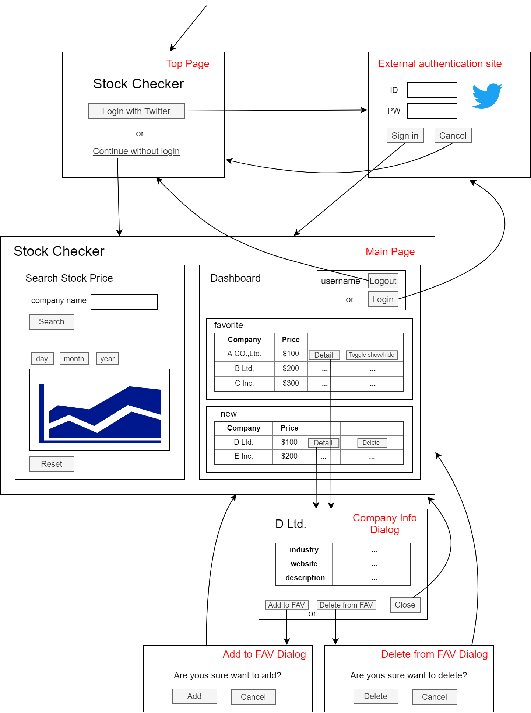
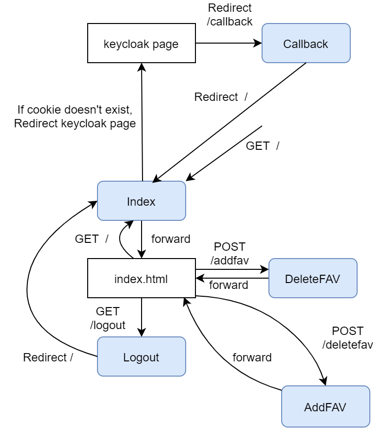
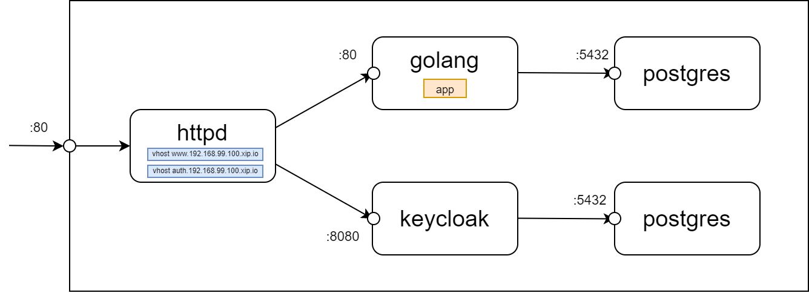

# StockChecker

## 概要
企業の株価を検索しグラフ表示する機能、またお気に入りした企業の株価を日次で@ツイートする機能を持つアプリケーション

## 機能

### ユーザログイン
* Twitterによるソーシャルログイン機能
	- 認証機能を持つOSSである keycloak を使用する

### 株価検索
* 企業ID (symbol) 検索機能
	- IEX API のデータを使用する
	- メインページ表示時に企業一覧を読み込み、フォームへのキーボード入力に応じて検索候補を表示させる

* 株価検索機能
	- IEX API のデータを使用する
	- 対象企業の symbol をもとに株価を検索し、ダッシュボードに表示する

* 株価推移グラフ表示機能
	- 1日、1か月、1年等の株価データを読込み
	- グラフ描画ライブラリの Chart.js を使用する

### 企業お気に入り登録、ツイート機能
* 企業お気に入り登録／削除機能
	- 対象企業を、ユーザお気に入りDBに登録／削除する
	- お気に入り企業は、ユーザログイン後のメインページ表示時に株価表示される

* 株価ツイート機能
	- お気に入り登録された企業の株価終値を、日次でユーザあてにツイート

## 画面遷移図



## テーブル設計

### お気に入り（FAVORITES）
| No | 論理名 | 物理名 | データ型(桁数) | PK | NOT NULL | 備考 |
| :- | :- | :- | :- | :- | :- | :- |
| 1 | お気に入りID | favorite_id | BIGINT | 〇 | | 固有の管理番号 |
| 2 | ユーザ名 | user_id | VARCHAR(100) | | 〇 | Twitter ID |
| 3 | 企業ID | symbol | VARCHAR(100) | | 〇 | |


## 内部処理遷移図



## システムアーキテクチャ概要
Docker コンテナを使用する


## ディレクトリ階層
```
./app
│
├─main.go
│
├─controller
│    ├─addtofav.go
│    └─deletefromfav.go
│
├─model
│    └─favorite.go
│
├─view
│     ├─css
│     │   └─ style.css
│     ├─js
│     │   ├─
│     │   └─
│     └─index.html
│
└─utils
     ├─utils.go
     └─authenticate.go
```