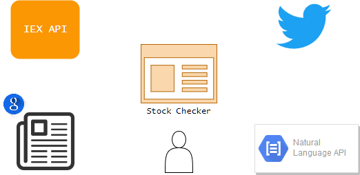
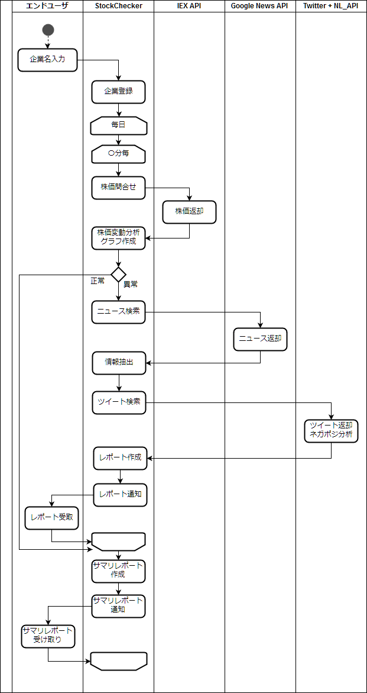
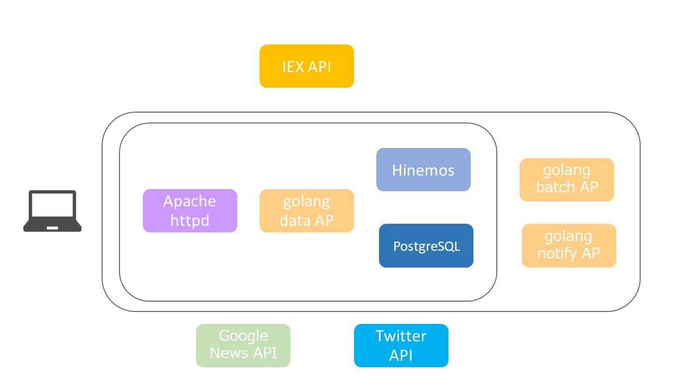

# (検討段階)
# アプリ名：StockChecker

# 概要
* 株価を監視、関連する情報とともに可視化するWebアプリケーション
* 企業ニュースと株価、ツイートとの関連を検証する

# システム要件定義

## アクター定義

| アクター | 役割 |
| :- | :- |
| Stock Checker | 本アプリケーション |
| IEX API | 株価の取得 |
| Twitter API | 企業について言及されたツイートを取得 |
| Google News API | 企業に関するニュースを取得 |
| Google NL API | Googleニュース・ツイートの解析 |

## 業務フロー

## 機能一覧
* 企業登録機能
* 株価取得機能
* 株価分析／グラフ作成機能
* レポート作成機能
	- Googleニュース検索
	- ツイート検索
	- ツイートネガポジ分析
* 即時レポート通知機能
* サマリレポート作成機能
* サマリレポート通知機能

## 非機能要件
* Hinemos を使いたい

## システムアーキテクチャ概要
※イメージ図

# AP外部設計

## 処理設計

# AP内部設計

## コンポーネント設計

# システム基盤設計